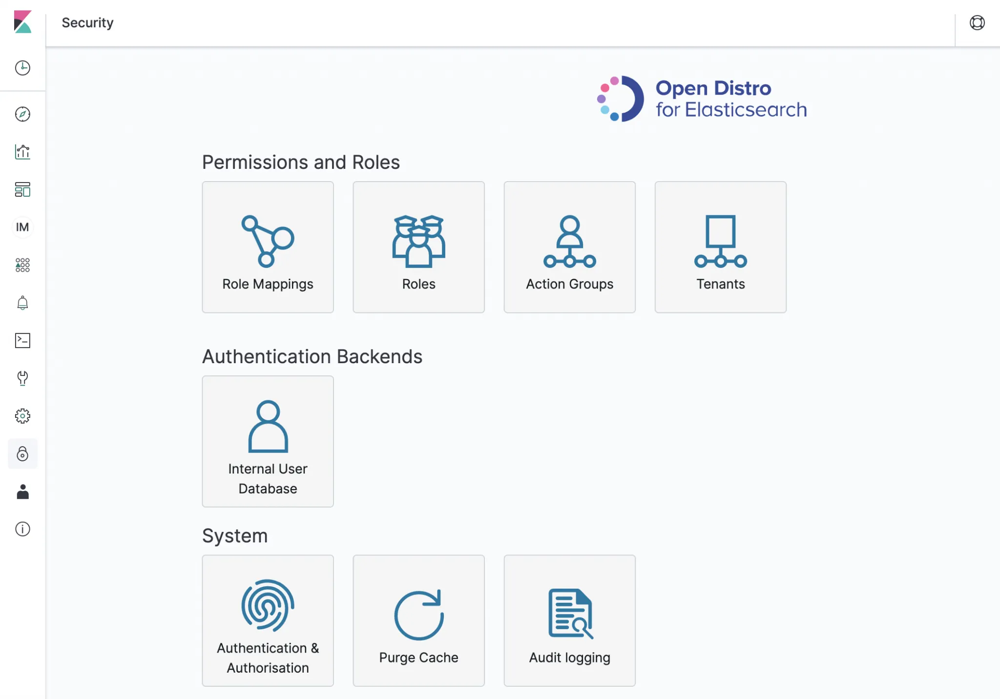
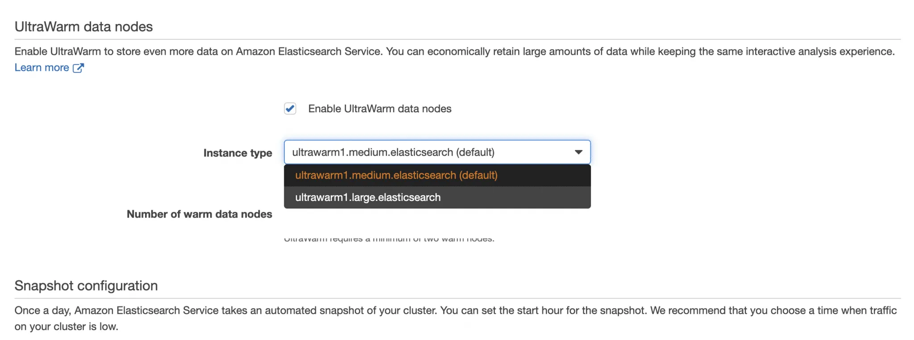

## AWS ElasticSearch Service

This article provides guidance on setting up an Elasticsearch cluster with Kibana on AWS (Amazon Web Services) cloud platform using CloudFormation. Also, it provides the user with instructions on how to access the cluster and Kibana endpoints.

**Need for Elasticsearch and Use Cases**
  
Elasticsearch is a managed AWS (Amazon Web Services) service for Log analytics and management. A common use case is Monitoring Infrastructure or Application Performance and assisting in failure diagnosis. Subsequently, It can also capture events for proactive monitoring of security threats. More examples of Elasticsearch uses include:.
  - To Analyse VPC Flow Logs to capture unwanted traffic accessing your VPC.
  
  - For, Analysis of CloudTrail Logs for monitoring user activity and API calls made on your AWS account.
  
  - Analysis of Container Insights Application Logs for fault diagnosis of applications running on AWS container platforms.
  
  - We can stream data to an elastic search cluster from various sources. Some sources include S3 buckets, CloudWatch log groups, DynamoDB or AWS IoT.

**Need for Elasticsearch and Use Cases**

Before setting up, the user needs to ensure that they have the following requirements:

  - An AWS account.
  - A user with the permissions to create Resources on AWS

**Elasticsearch and Kibana Setup:**

  - An Elasticsearch cluster can have either an internet or VPC endpoint.

  - To begin with, access to an internet endpoint cluster is achieved via the aws-es-kibana proxy. For a VPC endpoint cluster, a user has to type the Kibana or cluster URL on a browser within a windows bastion host setup inside the same VPC as the cluster.
  
  - Use the below CloudFormation template to create an internet endpoint cluster. A user can customize the template to their specific needs. Set correct ARN for MasterUserARN and value for Resource

              AWSTemplateFormatVersion: "2010-09-09"
              Description: "Template to create Elasticsearch domain"

              Resources:
                  ElasticSearchCluster:            
                      Type: AWS::Elasticsearch::Domain
                      Properties: 
                          DomainName: test-elasticsearch
                          AdvancedSecurityOptions:
                              Enabled: true
                              InternalUserDatabaseEnabled: false
                              MasterUserOptions:
                                 MasterUserARN: arn:aws:iam::*************:user/test 
                          ElasticsearchVersion: 7.7
                          EncryptionAtRestOptions:
                              Enabled: true 
                          DomainEndpointOptions:
                              EnforceHTTPS: true
                          ElasticsearchClusterConfig:
                              DedicatedMasterEnabled: "true"
                              DedicatedMasterType: "c4.large.elasticsearch"
                              DedicatedMasterCount: "3"
                              InstanceCount: 2
                              InstanceType: "c4.large.elasticsearch"
                          NodeToNodeEncryptionOptions:
                              Enabled: true                
                          EBSOptions:
                              EBSEnabled: true
                              VolumeSize: 20
                              VolumeType: gp2
                          AccessPolicies:
                              Version: "2012-10-17"
                              Statement:
                                -
                                  Effect: "Allow"
                                  Principal:
                                     AWS: "*"
                                  Action: "es:*"
                                  Resource: "arn:aws:es:us-east-1:***********:domain/test-elasticsearch/*"
              Outputs:
                ESCluster:
                  Description: The ES Cluster
                  Value: !Ref ElasticSearchCluster

To access Kibana for your internet access endpoint cluster follow the below instructions:
  - Install AWS CLI on your machine/Terminal.
  
  - Then configure your aws credentials using the command (aws configure). Ensure that the credentials you set up for aws on your terminal are the master user credentials that you used to create your cluster on the template above.
  
  - Install node on your machine/Terminal.
  
  - Install aws-es-kibana proxy using the command (npm install -g aws-es-kibana).
  
  - Run the command (aws-es-kibana your es endpoint without the https).
  
  - Finally, from the output of the command, copy the Kibana URL and paste it on your browser.
  
  - You now have access to Kibana.

The below CloudFormation Template creates a VPC/Private access endpoint cluster. A user can customize the template to their specific needs.

              AWSTemplateFormatVersion: "2010-09-09"
              Description: "Template to create ElasticSearch domain"
              Parameters:
                  VPC:
                      Type: String
                      Description: The ID of your VPC
                      Default: vpc-ID
                  PrivateSubnet01:
                      Type: String
                      Description: The ID of your subnet
                      Default: subnet-ID
                  UserName:
                      Type: String
                      Description: The ES master user Name
                  UserPassword:
                      Type: String
                      Description: The ES master user Password
                      NoEcho: true
              Resources:
                  ESSecurityGroup:
                      Type: "AWS::EC2::SecurityGroup"
                      Properties:
                          GroupDescription: "security group for ES Cluster access"
                          GroupName: "test-ES-sg"
                          VpcId: !Ref VPC
                          SecurityGroupIngress: 
                            - 
                              CidrIp: "0.0.0.0/0"
                              FromPort: 80
                              IpProtocol: "tcp"
                              ToPort: 80
                            - 
                              CidrIp: "0.0.0.0/0"
                              FromPort: 443
                              IpProtocol: "tcp"
                              ToPort: 443
                          SecurityGroupEgress: 
                            - 
                              CidrIp: "0.0.0.0/0"
                              IpProtocol: "-1"
                  ElasticSearchCluster:            
                      Type: AWS::Elasticsearch::Domain
                      Properties: 
                          DomainName: test-elasticsearch
                          AdvancedSecurityOptions:
                              Enabled: true
                              InternalUserDatabaseEnabled: true
                              MasterUserOptions:
                                 MasterUserName: !Ref UserName
                                 MasterUserPassword: !Ref UserPassword 
                          ElasticsearchVersion: 7.7
                          EncryptionAtRestOptions:
                              Enabled: true 
                          DomainEndpointOptions:
                              EnforceHTTPS: true
                          ElasticsearchClusterConfig:
                              DedicatedMasterEnabled: "true"
                              DedicatedMasterType: "c4.large.elasticsearch"
                              DedicatedMasterCount: "3"
                              InstanceCount: 1
                              InstanceType: c4.large.elasticsearch
                          NodeToNodeEncryptionOptions:
                              Enabled: true                
                          EBSOptions:
                              EBSEnabled: true
                              VolumeSize: 20
                              VolumeType: gp2
                          VPCOptions: 
                              SecurityGroupIds:
                                - !Ref ESSecurityGroup
                              SubnetIds:
                                - !Ref PrivateSubnet01
                          AccessPolicies:
                              Version: "2012-10-17"
                              Statement:
                                -
                                  Effect: "Allow"
                                  Principal:
                                     AWS: "*"
                                  Action: "es:*"
                                  Resource: "arn:aws:es:us-east-1:************:domain/test-elasticsearch/*"

              Outputs:
                ESCluster:
                  Description: Public Subnet 01 ID in the VPC
                  Value: !Ref ElasticSearchCluster
                  
**Kibana User Access Management:**

  - One of the most important tasks is to add other users and manage access to Kibana using roles and role mappings. Also, it is important to enable audit logs for Kibana for monitoring user access.

  - To add users and create roles to assign to users on Kibana, login to Kibana. Then, On the leftmost side, scroll down to the security icon (padlock looking icon) and click on it. It will open a window that allows you to create roles and map users to those roles. See below:
  
    

**N/B:** Only the master user has access to the security tab when the Elasticsearch cluster is first created. Access to the security tab allows a user to create roles and assign roles to users. Subsequently, to allow other users to have access to the security tab we have to assign them the security manager role. On the security tab, go to role mappings and under security manager add your user IAM user ARN.
To enable audit logs for Kibana, On the security tab still click on Audit Logging. Then check on enable audit logging. Back on the AWS Elastic search console, On the dashboard, click on your cluster and select the logs tab. Scroll down to Set up Audit logs. Click on enable and follow instructions to select a CloudWatch log group to publish your logs to.

**Elasticsearch Log Management and Data Storage Options:**

  - It is expensive to maintain an Elasticsearch cluster without proper log management because storage costs will skyrocket.

  - AWS Elasticsearch provides Ultra-warm Storage allowing users to store petabyte-scale data at a much cheaper cost. To use this feature, one has to enable Ultra-warm storage on their cluster as below. On the Elasticsearch console go to the domain you created. 

  - Click on the Edit domain. And scroll down to Ultra-warm data nodes. See the below image.

    
    
  - Besides enabling Ultra-warm storage, a user has to create an index policy to enable indices to transition from hot to warm storage. An example of an index policy to migrate data/index from hot to warm then to delete stage is as below. 

  - To create a policy login to Kibana. Then on the leftmost side scroll down to the Index Management icon. Click on it and it opens the Index Management tab. From here one can create a policy and apply the policy to indices. 

**Important Links:**
Further Links for Study:

<a href="https://docs.aws.amazon.com/elasticsearch-service/latest/developerguide/es-createupdatedomains.html">Creating and Managing Amazon Elasticsearch Service Domains.</a>

<a href="https://docs.aws.amazon.com/elasticsearch-service/latest/developerguide/es-gsg.html">Getting Started with Amazon Elasticsearch Service.</a>
